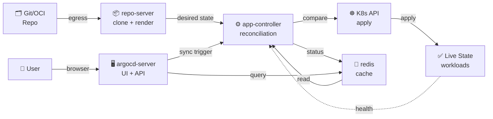
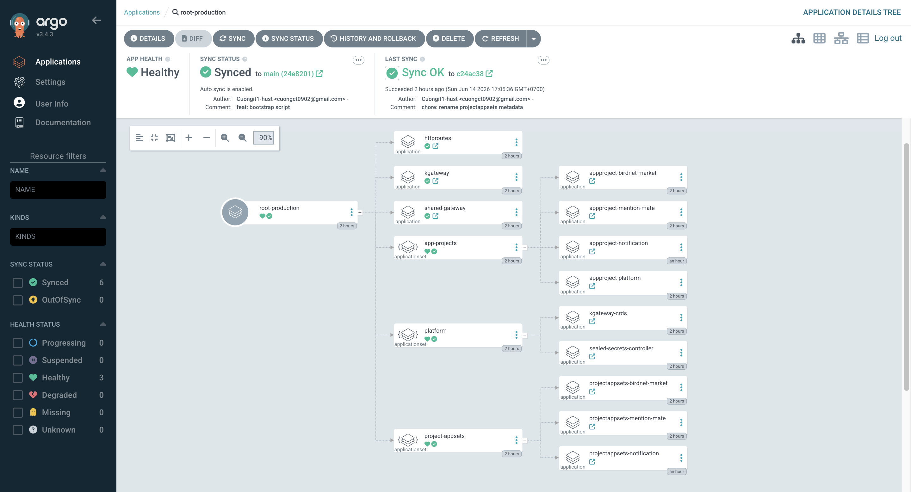

# Gitops Training Labs

Lab GitOps trên ArgoCD: **App-of-Apps + ApplicationSet** nhiều tầng, multi-source, **1 base Helm chart dùng chung**.
Single branch (`main`), directory-based. Tách **2 tier theo cluster**:

- **`root-nonproduction`** → quản lý **dev + staging** (apply lên ArgoCD của cluster nonprod)
- **`root-production`** → quản lý **prod** (apply lên ArgoCD của cluster prod)

> Mỗi cluster có ArgoCD riêng (per-cluster), mọi destination = in-cluster. 2 tier giống hệt nhau,
> chỉ khác **env filter** (nonproduction = dev+staging, production = prod).

## Kiến trúc ArgoCD

| Thành phần | Vai trò |
|---|---|
| **application-controller** | Reconciliation (so desired vs live), sync, health check |
| **repo-server** | Clone repo, render manifest. Nút thắt → cần scale + cache khi repo lớn |
| **applicationset-ctrl** | Sinh Application từ generator |
| **argocd-server** | API + Web UI + auth (SSO/Dex) |
| **redis** | Cache trạng thái/manifest |

### Flow Diagram



**Lab**: mỗi cluster có 1 ArgoCD riêng, destination = in-cluster. repo-server cần egress để pull OCI/Git.


## Cấu trúc thư mục
```
main
├── root-nonproduction.yaml          # apply lên ArgoCD cluster nonprod
├── root-production.yaml             # apply lên ArgoCD cluster prod
├── bootstrap/
│   ├── nonproduction/               # production/ = bản sao, chỉ khác env filter
│   │   ├── app-projects.yaml         (appset)         ┐ 6 file cấp 1
│   │   ├── platform.yaml             (appset)         │ (root đọc, recurse:false)
│   │   ├── kgateway.yaml             (App)            │
│   │   ├── project-appsets.yaml      (appset)         │
│   │   ├── shared-gateway.yaml       (App)            │
│   │   ├── httproutes.yaml           (App)            ┘
│   │   ├── app-projects/{platform,birdnet-market,mention-mate}/app-project.yaml
│   │   └── project-appsets/{birdnet-market,mention-mate}/applicationset.yaml
│   └── production/ ...
├── platform/gateway/               # shared-gw DÙNG CHUNG: GatewayParameters + Gateway *.cuongct.work
├── platform/httproutes/            # HTTPRoute đứng riêng (argocd...) trỏ shared-gw
├── helm-charts/app/                # 1 base chart duy nhất
└── apps/<project>/<app>/overlays/<env>/values.yaml
```

## Design Pattern: Directory-based GitOps

Lab dùng **single branch + directory-based overlays** — mỗi env (dev/staging/prod) là 1 thư mục `overlays/<env>`. 
Promotion = PR dổi file overlay, tất cả trên 1 branch.

### Trade-off

| Pattern | ✅ Ưu điểm | ❌ Nhược điểm | Phù hợp |
|---|---|---|---|
| **Directory-based** | Dễ review (diff nhỏ), quản lý unified, tái sử dụng Helm/Kustomize base | Repo lớn, CI chậy nếu không filter, khó enforce per-team permission | Multi-app, team chung, promotion controlled |
| **Monorepo** | Atomic commit (toàn bộ service), CI unified, dễ refactor | Khó phân chia responsibility, GitOps per-service phức tạp, secret collision | Big company (Google, Meta) nhiều service |
| **Polyrepo** | Full autonomy, tách biệt rõ ràng, per-team ownership | Promotion across repos phức tạp, sync khó, many credentials | Microservice lớn, teams độc lập |
| **Single Repo Single App** | Simple, clear ownership | Không scale, mỗi app tạo mới, khó shared configs | Startup, small team, mỗi app/team làm riêng |

**Lab chọn directory-based vì:**
- ✅ Quản lý unified (2 tier, multi-project, mỗi tier dùng chung 1 base chart)
- ✅ Overlay dễ review + promote (kustomize/helm overlay tự nhiên match directory structure)
- ✅ ApplicationSet quét overlays → tự động scale khi thêm app/env
- ✅ Phù hợp team kỹ thuật chung với central governance (AppProject + RBAC)

## Bootstrap (Cluster Setup)


### Bootstrap Flow
```bash
kubectl apply root-<tier>.yaml (1 lần / cluster)
  │ recurse:false → đọc 6 file cấp 1 của bootstrap/<tier>/
  ▼
root-<tier> (App-of-Apps) kích hoạt 6 components theo wave:
├─ wave -2: app-projects appset → AppProject
├─ wave -1: platform appset → sealed-secrets + kgateway-crds (CRDs, SSA)
├─ wave 0:  kgateway App → controller + project-appsets appset
│           └─ (tầng 3) per-project appset quét apps/<proj>/*/overlays/<env>
├─ wave 1:  shared-gateway App → Gateway shared-gw
└─ wave 2:  httproutes App → HTTPRoute đứng riêng
     ▼
workload {project}-{app}-{env} (multi-source, cả 2 sources = main)
```

**Giải thích:**
- `root-<tier>` apply 1 lần, trigger toàn bộ architecture
- Wave ordering đảm bảo trình tự: AppProject trước (phân quyền), CRDs + controller tiếp, Gateway & HTTPRoute cuối cùng
- Tầng 3 (per-project appsets) tự động quét overlays → sinh workload Applications
- Mỗi workload = multi-source (helm-charts/app base + values.yaml env-specific)

**Điểm khác:**
- `kgateway` **KHÔNG dùng SSA** (riêng biệt khỏi CRDs), vì controller đọc config lúc startup
- `platform` appset **có SSA**, để tự động update CRDs khi kgateway version tăng

> ApplicationSet chỉ sinh được **Application**, nên "appset quản lý AppProject / quản lý appset con"
> đều dùng App-of-Apps gián tiếp: appset → App → (AppProject | ApplicationSet) manifest.


### E2E Setup

**Lab dùng `kind`** (Kubernetes In Docker): chạy K8s trong Docker, nhanh để dev/test. **Production** thay thế: **EKS/GKE/AKS** (cloud managed), **kubeadm** (on-prem), **kubespray** (Ansible, multi-cloud).

#### 1. Tạo cluster

```bash
# Tạo 2 cluster: nonproduction (dev+staging) và production (prod)
kind create cluster --name nonproduction --config kind-nonproduction.yaml
kind create cluster --name production --config kind-production.yaml

# Kiểm tra context đã tạo
kubectl config get-contexts
# Chọn một trong hai context để thực hiện bootstrap cụm
# kubectl config use-context kind-nonproduction
# kubectl config use-context kind-production
```

#### 2. Cài đặt Gateway API CRDs

```bash
# Cần thiết cho kgateway controller
kubectl apply -f https://github.com/kubernetes-sigs/gateway-api/releases/download/v1.5.1/standard-install.yaml
```

#### 3. Cài đặt ArgoCD

```bash
# Tạo namespace argocd
kubectl create namespace argocd

# Cài ArgoCD (>= 3.1, lab pin 3.3.x)
kubectl apply -n argocd --server-side -f https://raw.githubusercontent.com/argoproj/argo-cd/stable/manifests/install.yaml

# Bật insecure mode (server.insecure) để expose qua gateway mà không cần SSL
# ⚠️ Cập nhật configmap trực tiếp, sau đó restart argocd-server để áp dụng
kubectl -n argocd patch configmap argocd-cmd-params-cm --type merge -p '{"data":{"server.insecure":"true"}}'
kubectl -n argocd rollout restart deploy argocd-server
```

#### 4. Thêm Helm OCI repository cho kgateway

```bash
# Repo public, ArgoCD clone không cần creds
# OCI Helm support yêu cầu ArgoCD >= 3.1
argocd repo add cr.kgateway.dev/kgateway-dev/charts --type helm --enable-oci
```

#### 5. Apply root ApplicationSet cho cả 2 tier

```bash
# Trên cluster nonproduction (dev + staging)
kubectl config use-context kind-nonproduction
kubectl apply -f root-nonproduction.yaml

# Trên cluster production (prod)
kubectl config use-context kind-production
kubectl apply -f root-production.yaml
```

#### 6. Lấy admin password

```bash
# Giải mã password admin của ArgoCD
kubectl -n argocd get secret argocd-initial-admin-secret -o jsonpath="{.data.password}" | base64 --decode; echo
```

#### 7. Port-forward để truy cập ArgoCD UI

```bash
# Trên cluster nonproduction (port 9090)
kubectl config use-context kind-nonproduction
kubectl -n argocd port-forward svc/argocd-server 9090:80

# Trên cluster production (port 9091, terminal khác)
kubectl config use-context kind-production
kubectl -n argocd port-forward svc/argocd-server 9091:80
```

ArgoCD UI sẽ expose qua shared Gateway `shared-gw` tại `argocd.cuongct.work` (cần map DNS → NodePort) 
hoặc qua port-forward ở trên.

#### 8. Tìm NodePort để truy cập qua Gateway

```bash
# Lấy NodePort của shared-gw (default port 80)
kubectl -n kgateway-system get svc -l gateway.networking.k8s.io/gateway-name=shared-gw \
  -o jsonpath='{.items[0].spec.ports[?(@.port==80)].nodePort}'

# Map DNS: argocd.cuongct.work → <nodeIP>:<nodePort>
```

## Development
### Base chart `app`

1 chart cho mọi app, render theo map `components`:

- mỗi component → 1 **Deployment** (+ **Service** nếu có `port`, + **ConfigMap** nếu có `config`, + **HTTPRoute** nếu `httpRoute.enabled`)
- 1 component = single-deployment; nhiều component = multi-deployment
- **1 SealedSecret** dùng chung cho cả release; HTTPRoute gắn vào **Gateway dùng chung** `shared-gw`

Mỗi workload Application multi-source, **cả hai cùng `main`**: `source[0]` = `helm-charts/app`, `source[1]` = `values.yaml` của env (`$values`).
Cấu trúc `components` đầy đủ: xem `helm-charts/app/values.yaml`.

### Thêm mới

- **Thêm env**: tạo `apps/<project>/<app>/overlays/<env>/values.yaml` + thêm path env vào appset của project ở tier tương ứng.
- **Thêm app**: tạo `apps/<project>/<newapp>/overlays/<env>/...` (appset của project tự quét).
- **Thêm project**: thêm `apps/<newproject>/...`, `bootstrap/<tier>/app-projects/<newproject>/appproject.yaml`, `bootstrap/<tier>/project-appsets/<newproject>/applicationset.yaml` (appset cha tự quét).

### SealedSecret

Repo test đặt `sealedSecret.enabled: false` (image `traefik/whoami`). Khi cần secret thật, bật lại và seal —
scope `strict` gắn theo name+namespace, tên secret = `<release>-secret`:

```bash
./scripts/seal.sh mention-mate-dev mention-mate-app-dev-secret DB_PASSWORD=... API_KEY=...
```

#### Workflow chi tiết

```
secret thô ──kubeseal + public key──► SealedSecret (ciphertext) ──commit main
                                              │ ArgoCD sync
                                              ▼
                  controller (private key) giải mã ──► Secret thật ──► pod
```

1. Lấy public key từ cluster và seal secret:
   ```bash
   # secret-name = <release>-secret = {project}-{app}-{env}-secret
   ./scripts/seal.sh mention-mate-dev mention-mate-app-dev-secret DB_PASSWORD=... API_KEY=...
   ```
2. Dán `encryptedData` vào `values.yaml`, đặt `sealedSecret.enabled: true`
3. Commit lên `main` → ArgoCD sync → controller giải mã → Secret thật được tạo trong cluster

#### Lưu ý quan trọng

> ⚠️ **scope `strict`** gắn cứng theo `name` + `namespace` — ciphertext **không dùng lại được** ở cluster khác hay namespace khác.
>
> ⚠️ **Mất private key của controller = mất mọi secret** → phải backup key thường xuyên:
> ```bash
> kubectl -n kube-system get secret \
>   -l sealedsecrets.bitnami.com/sealed-secrets-key \
>   -o yaml > sealed-secrets-master-key-backup.yaml
> ```
>
> 💡 Giải pháp thay thế: **External Secrets**, **SOPS+age**, **Vault**.

## Debug / Troubleshooting

| Triệu chứng | Nguyên nhân | Xử lý |
|---|---|---|
| **kgateway App: Comparison Error OCI, failed to pull chart** | ArgoCD chưa add OCI repo hoặc auth sai | `argocd repo add cr.kgateway.dev/... --type helm --enable-oci` + ArgoCD >= 3.1 |
| **platform appset: CRDs OutOfSync / SSA Conflict** | CRD manifest conflict (multiple sources update) | Dùng wave (platform=-1), kgateway=0; hoặc thêm `Replace` syncOption trong appset |
| **Workload Application không sinh** (appset stuck) | ProjectSet appset generator path sai, hoặc namespace chưa được tạo | Kiểm tra `apps/<project>/<app>/overlays/<env>/values.yaml` tồn tại; AppProject `namespace: <tier>-<env>` allow |
| **destination not permitted** (AppProject reject) | AppProject permit namespace/cluster không match | AppProject `destinations.server: https://kubernetes.default.svc`, `namespaces: [<tier>-*]` |
| **HTTPRoute không attach vào Gateway** | Gateway name sai, namespace sai, port mismatch | HTTPRoute `parentRefs.name: shared-gw`, namespace=kgateway-system, `sectionName: http` |
