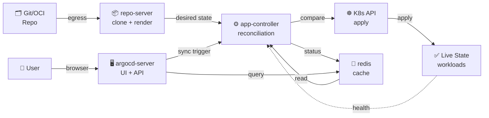

# GitOps Training Labs

## Table of Contents

* [Overview](#overview)
* [ArgoCD Architecture](#argocd-architecture)
  * [Flow Diagram](#flow-diagram)
* [Directory Structure](#directory-structure)
* [Design Pattern: Directory-based GitOps](#design-pattern-directory-based-gitops)
  * [Trade-off](#trade-off)
* [Bootstrap (Cluster Setup)](#bootstrap-cluster-setup)
  * [Bootstrap Flow](#bootstrap-flow)
  * [E2E Setup](#e2e-setup)
    * [1. Create cluster](#1-create-cluster)
    * [2. Install Gateway API CRDs](#2-install-gateway-api-crds)
    * [3. Install ArgoCD](#3-install-argocd)
    * [4. Add Helm OCI repository for kgateway](#4-add-helm-oci-repository-for-kgateway)
    * [5. Apply the root ApplicationSet for both tiers](#5-apply-the-root-applicationset-for-both-tiers)
    * [6. Retrieve the admin password](#6-retrieve-the-admin-password)
    * [7. Port-forward to access the ArgoCD UI](#7-port-forward-to-access-the-argocd-ui)
    * [8. Find the NodePort to access via the Gateway](#8-find-the-nodeport-to-access-via-the-gateway)
* [Development](#development)
  * [Base chart `app`](#base-chart-app)
  * [Add new](#add-new)
  * [SealedSecret](#sealedsecret)
    * [Detailed workflow](#detailed-workflow)
    * [Important notes](#important-notes)
* [Debug / Troubleshooting](#debug--troubleshooting)
* [Discussion](#discussion)

## Overview
GitOps lab on ArgoCD: **App-of-Apps + ApplicationSet** across multiple tiers, multi-source, with **one shared base Helm chart**.
Single branch (`main`), directory-based. Split into **2 tiers by cluster**:

- **`root-nonproduction`** → manages **dev + staging** (applied to the ArgoCD instance of the nonprod cluster)
- **`root-production`** → manages **prod** (applied to the ArgoCD instance of the prod cluster)

> Each cluster has its own ArgoCD instance (per-cluster), every destination = in-cluster. The two tiers are identical,
> differing only by the **env filter** (nonproduction = dev+staging, production = prod).

## ArgoCD Architecture

| Component | Role |
|---|---|
| **application-controller** | Reconciliation (compare desired vs live), sync, health check |
| **repo-server** | Clone repo, render manifests. Bottleneck → needs scaling + caching when the repo is large |
| **applicationset-ctrl** | Generate Applications from the generator |
| **argocd-server** | API + Web UI + auth (SSO/Dex) |
| **redis** | Cache state/manifests |

### Flow Diagram



**Lab**: each cluster has its own ArgoCD instance, destination = in-cluster. The repo-server needs egress to pull OCI/Git.

## Directory Structure
```text
main
├── root-nonproduction.yaml          # applied to the ArgoCD nonprod cluster
├── root-production.yaml             # applied to the ArgoCD prod cluster
├── bootstrap/
│   ├── nonproduction/               # production/ = copy, only differs by env filter
│   │   ├── app-projects.yaml         (appset)         ┐ 6 top-level files
│   │   ├── platform.yaml             (appset)         │ (root reads, recurse:false)
│   │   ├── kgateway.yaml             (App)            │
│   │   ├── project-appsets.yaml      (appset)         │
│   │   ├── shared-gateway.yaml       (App)            │
│   │   ├── httproutes.yaml           (App)            ┘
│   │   ├── app-projects/{platform,birdnet-market,mention-mate}/app-project.yaml
│   │   └── project-appsets/{birdnet-market,mention-mate}/applicationset.yaml
│   └── production/ ...
├── platform/gateway/               # shared-gw used in common: GatewayParameters + Gateway *.cuongct.work
├── platform/httproutes/            # HTTPRoute stands alone (argocd...) pointing to shared-gw
├── helm-charts/app/                # one single base chart
└── apps/<project>/<app>/overlays/<env>/values.yaml
```

## Design Pattern: Directory-based GitOps

Lab uses **single branch + directory-based overlays** — each env (dev/staging/prod) is a directory `overlays/<env>`.
Promotion = PR changing overlay files, all on one branch.

### Trade-off

| Pattern | ✅ Advantages | ❌ Disadvantages | Suitable for |
|---|---|---|---|
| **Directory-based** | Easy review (small diff), unified management, reusable Helm/Kustomize base | Large repo, CI can become noisy without filtering, difficult to enforce per-team permissions | Multi-app, shared teams, controlled promotion |
| **Monorepo** | Atomic commit (entire service), unified CI, easier refactor | Hard to divide responsibility, complex per-service GitOps, secret collision | Large companies (Google, Meta) with many services |
| **Polyrepo** | Full autonomy, clear separation, per-team ownership | Promotion across repos is complex, syncing is difficult, many credentials | Large microservices, independent teams |
| **Single Repo Single App** | Simple, clear ownership | Does not scale, each app creates new work, difficult shared configs | Startup, small team, each app/team works separately |

**The lab chooses directory-based because:**
- ✅ Unified management (2 tiers, multi-project, each tier uses the same base chart)
- ✅ Overlays are easy to review and promote (kustomize/helm overlays naturally match the directory structure)
- ✅ ApplicationSet scans overlays → automatically scales when adding apps/envs
- ✅ Suitable for a shared engineering team with central governance (AppProject + RBAC)

## Bootstrap (Cluster Setup)


### Bootstrap Flow
```bash
kubectl apply root-<tier>.yaml (once per cluster)
  │ recurse:false → reads the 6 top-level files in bootstrap/<tier>/
  ▼
root-<tier> (App-of-Apps) triggers 6 components by wave:
├─ wave -2: app-projects appset → AppProject
├─ wave -1: platform appset → sealed-secrets + kgateway-crds (CRDs, SSA)
├─ wave 0:  kgateway App → controller + project-appsets appset
│           └─ (layer 3) per-project appset scans apps/<proj>/*/overlays/<env>
├─ wave 1:  shared-gateway App → Gateway shared-gw
└─ wave 2:  httproutes App → HTTPRoute stands alone
     ▼
workload {project}-{app}-{env} (multi-source, both sources = main)
```

**Explanation:**
- `root-<tier>` is applied once, triggering the full architecture
- Wave ordering ensures the sequence: AppProject first (permissions), then CRDs + controller, and Gateway + HTTPRoute last
- Layer 3 (per-project appsets) automatically scans overlays → generates workload Applications
- Each workload is multi-source (Helm chart base `helm-charts/app` + env-specific `values.yaml`)

**Differences:**
- `kgateway` does **not** use SSA (separate from CRDs), because the controller reads config at startup
- `platform` appset **uses SSA** to automatically update CRDs when the kgateway version increases

> ApplicationSet can only generate **Application** objects, so both "appset managing AppProject / managing child appset"
> are used indirectly via App-of-Apps: appset → App → (AppProject | ApplicationSet) manifest.

### E2E Setup

**The lab uses `kind`** (Kubernetes In Docker): run K8s in Docker, fast for dev/test. **Production** alternatives are **EKS/GKE/AKS** (managed cloud), **kubeadm** (on-prem), and **kubespray** (Ansible, multi-cloud).

#### 1. Create cluster

```bash
# Create 2 clusters: nonproduction (dev+staging) and production (prod)
kind create cluster --name nonproduction --config kind-nonproduction.yaml
kind create cluster --name production --config kind-production.yaml

# Check the created contexts
kubectl config get-contexts
# Choose one of the two contexts to perform cluster bootstrap
# kubectl config use-context kind-nonproduction
# kubectl config use-context kind-production
```

#### 2. Install Gateway API CRDs

```bash
# Required for the kgateway controller
kubectl apply -f https://github.com/kubernetes-sigs/gateway-api/releases/download/v1.5.1/standard-install.yaml
```

#### 3. Install ArgoCD

```bash
# Create the argocd namespace
kubectl create namespace argocd

# Install ArgoCD (>= 3.1, lab pinned to 3.3.x)
kubectl apply -n argocd --server-side -f https://raw.githubusercontent.com/argoproj/argo-cd/stable/manifests/install.yaml

# Enable insecure mode (server.insecure) to expose it through the gateway without SSL
# ⚠️ Update the configmap directly, then restart argocd-server to apply it
kubectl -n argocd patch configmap argocd-cmd-params-cm --type merge -p '{"data":{"server.insecure":"true"}}'
kubectl -n argocd rollout restart deploy argocd-server
```

#### 4. Add Helm OCI repository for kgateway

```bash
# Public repo; ArgoCD clone does not need credentials
# OCI Helm support requires ArgoCD >= 3.1
argocd repo add cr.kgateway.dev/kgateway-dev/charts --type helm --enable-oci
```

#### 5. Apply the root ApplicationSet for both tiers

```bash
# On the nonproduction cluster (dev + staging)
kubectl config use-context kind-nonproduction
kubectl apply -f root-nonproduction.yaml

# On the production cluster (prod)
kubectl config use-context kind-production
kubectl apply -f root-production.yaml
```

#### 6. Retrieve the admin password

```bash
# Decode the ArgoCD admin password
kubectl -n argocd get secret argocd-initial-admin-secret -o jsonpath="{.data.password}" | base64 --decode; echo
```

#### 7. Port-forward to access the ArgoCD UI

```bash
# On the nonproduction cluster (port 9090)
kubectl config use-context kind-nonproduction
kubectl -n argocd port-forward svc/argocd-server 9090:80

# On the production cluster (port 9091, in another terminal)
kubectl config use-context kind-production
kubectl -n argocd port-forward svc/argocd-server 9091:80
```

The ArgoCD UI will be exposed through the shared Gateway `shared-gw` at `argocd.cuongct.work` (requires DNS mapping to NodePort)
or via port-forward above.

#### 8. Find the NodePort to access via the Gateway

```bash
# Get the NodePort of shared-gw (default port 80)
kubectl -n kgateway-system get svc -l gateway.networking.k8s.io/gateway-name=shared-gw \
  -o jsonpath='{.items[0].spec.ports[?(@.port==80)].nodePort}'

# Map DNS: argocd.cuongct.work → <nodeIP>:<nodePort>
```

## Development
### Base chart `app`

One chart for every app, rendered according to the `components` map:

- each component → one **Deployment** (+ **Service** if it has `port`, + **ConfigMap** if it has `config`, + **HTTPRoute** if `httpRoute.enabled`)
- one component = single-deployment; multiple components = multi-deployment
- **One SealedSecret** shared across the release; HTTPRoute attached to the shared Gateway `shared-gw`

Each workload Application is multi-source, **both from the same `main` branch**: `source[0]` = `helm-charts/app`, `source[1]` = the environment-specific values file (`$values`).
The full `components` structure: see `helm-charts/app/values.yaml`.

### Add new

- **Add env**: create `apps/<project>/<app>/overlays/<env>/values.yaml` + add the env path to the project appset at the corresponding tier.
- **Add app**: create `apps/<project>/<newapp>/overlays/<env>/...` (the project appset will scan it automatically).
- **Add project**: add `apps/<newproject>/...`, `bootstrap/<tier>/app-projects/<newproject>/appproject.yaml`, `bootstrap/<tier>/project-appsets/<newproject>/applicationset.yaml` (the parent appset will scan it automatically).

### SealedSecret

The test repo sets `sealedSecret.enabled: false` (image `traefik/whoami`). When a real secret is needed, enable it again and seal —
strict scope is tied to name+namespace, and the secret name is `<release>-secret`:

```bash
./scripts/seal.sh mention-mate-dev mention-mate-app-dev-secret DB_PASSWORD=... API_KEY=...
```

#### Detailed workflow

```text
raw secret ──kubeseal + public key──► SealedSecret (ciphertext) ──commit main
                                              │ ArgoCD sync
                                              ▼
                  controller (private key) decrypts ──► real Secret ──► pod
```

1. Get the public key from the cluster and seal the secret:
   ```bash
   # secret-name = <release>-secret = {project}-{app}-{env}-secret
   ./scripts/seal.sh mention-mate-dev mention-mate-app-dev-secret DB_PASSWORD=... API_KEY=...
   ```
2. Paste `encryptedData` into `values.yaml`, set `sealedSecret.enabled: true`
3. Commit to `main` → ArgoCD sync → controller decrypts → the real Secret is created in the cluster

#### Important notes

> ⚠️ **Strict scope** is hard-bound to `name` + `namespace` — ciphertext **cannot be reused** in a different cluster or namespace.
>
> ⚠️ **Losing the controller private key means losing all secrets** → back up the key regularly:
> ```bash
> kubectl -n kube-system get secret \
>   -l sealedsecrets.bitnami.com/sealed-secrets-key \
>   -o yaml > sealed-secrets-master-key-backup.yaml
> ```
>
> 💡 Alternatives: **External Secrets**, **SOPS+age**, **Vault**.

## Debug / Troubleshooting

| Symptom | Cause | Resolution |
|---|---|---|
| **kgateway App: Comparison Error OCI, failed to pull chart** | ArgoCD has not added the OCI repo or authentication is incorrect | `argocd repo add cr.kgateway.dev/... --type helm --enable-oci` + ArgoCD >= 3.1 |
| **platform appset: CRDs OutOfSync / SSA Conflict** | CRD manifest conflict (multiple sources update) | Use wave (platform=-1), kgateway=0; or add a `Replace` syncOption in the appset |
| **Workload Application is not generated** (appset stuck) | ProjectSet appset generator path is incorrect, or the namespace has not been created | Check that `apps/<project>/<app>/overlays/<env>/values.yaml` exists; AppProject `namespace: <tier>-<env>` allow |
| **destination not permitted** (AppProject reject) | AppProject does not permit the namespace/cluster combination | AppProject `destinations.server: https://kubernetes.default.svc`, `namespaces: [<tier>-*]` |
| **HTTPRoute is not attached to the Gateway** | Gateway name is wrong, namespace is wrong, or the port does not match | HTTPRoute `parentRefs.name: shared-gw`, namespace=kgateway-system, `sectionName: http` |

## Discussion
- Why is only the `root` app applied manually?
- Why is the `recurse: false` setting used in [root-nonproduction.yaml](root-nonproduction.yaml) / [root-production.yaml](root-production.yaml)?
- Why do CRDs use SSA while the controller does not?
- Why must the two sources (source 1: helm-chart/apps, source 2: the `values.yaml` files) be on the same `main` branch?